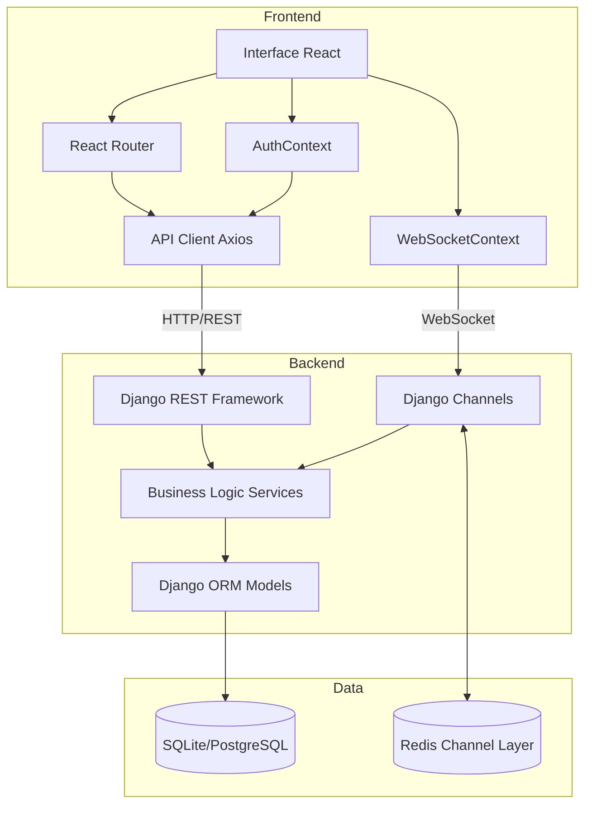
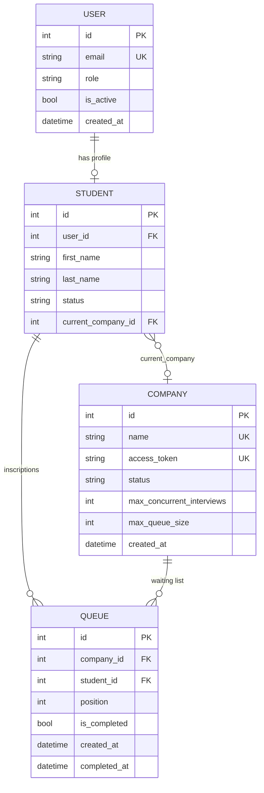
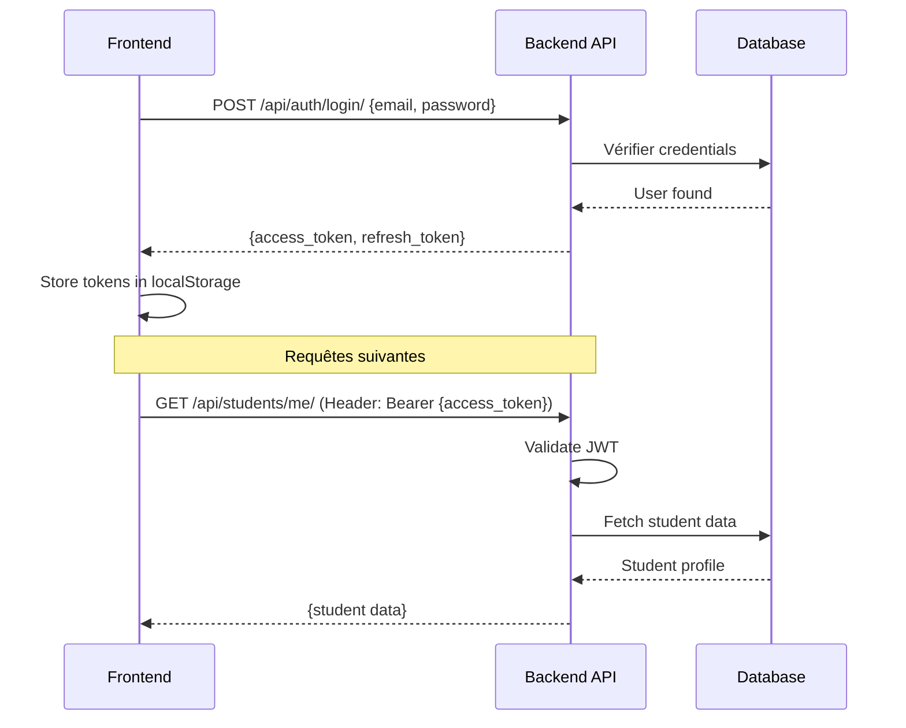
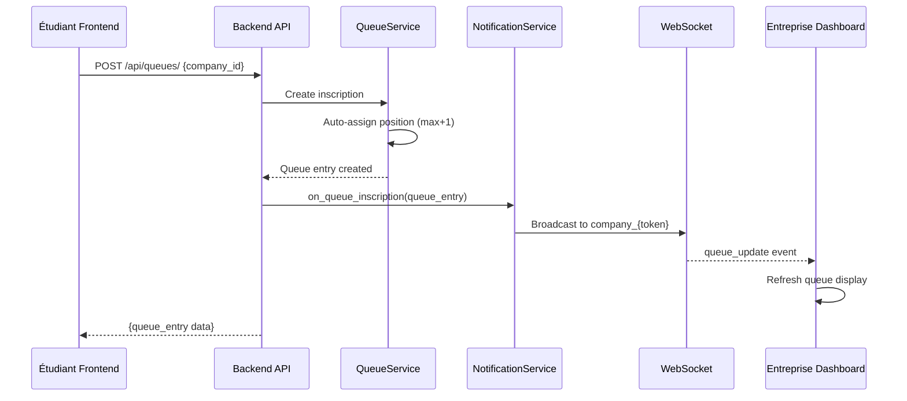
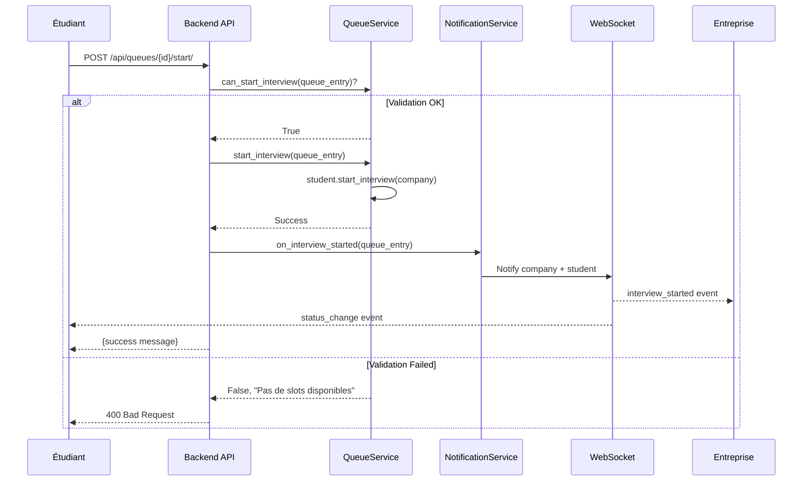
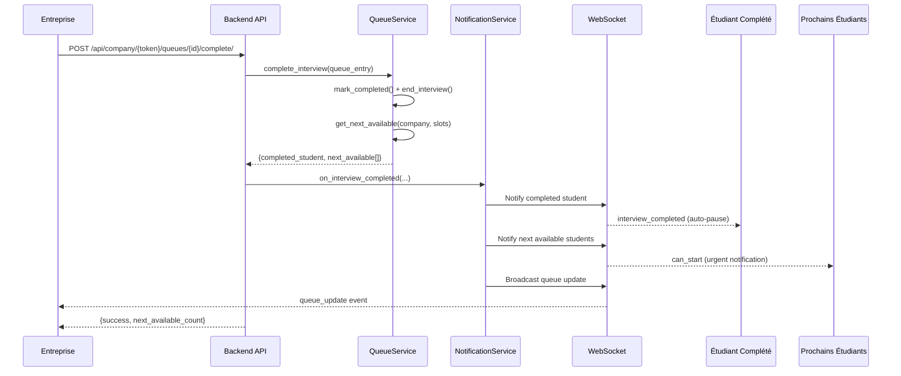

# 🏗️ Architecture de la Plateforme JobFair

Ce document détaille l'architecture technique de la plateforme, les modèles de données, les flux et les règles métier.

## Vue d'Ensemble

La plateforme JobFair suit une architecture classique client-serveur avec communication REST et WebSocket :



## Modèles de Données

### Schéma Relationnel



### Détails des Modèles

#### User (users.models.User)

Modèle utilisateur personnalisé pour l'authentification.

**Champs** :
- `email` : EmailField unique (USERNAME_FIELD)
- `role` : `student` | `admin`
- `is_active` : Compte actif ou non
- `is_staff` : Accès à l'admin Django
- `password` : Hash du mot de passe

**Relations** :
- OneToOne → `Student` (via `user.student`)

**Authentification** :
- Les utilisateurs s'authentifient via JWT
- Les entreprises n'utilisent PAS ce modèle (accès par token)

---

#### Student (students.models.Student)

Profil étudiant avec gestion de statut.

**Champs** :
- `user` : OneToOneField vers User
- `first_name`, `last_name` : Nom complet
- `status` : `available` | `in_interview` | `paused`
  - `available` : Peut démarrer un entretien, visible dans les files
  - `in_interview` : En entretien actuellement
  - `paused` : Doit manuellement repasser disponible
- `current_company` : ForeignKey vers Company (nullable)

**Méthodes importantes** :
- `is_available()` : Vérifie si l'étudiant peut démarrer un entretien
- `start_interview(company)` : Démarre un entretien (change statut + current_company)
- `end_interview()` : Termine l'entretien (auto-pause)
- `set_available()` : Repasse disponible (action manuelle)

**Transitions de statut** :
```
available → in_interview  (étudiant clique "Commencer")
in_interview → paused     (entreprise marque "Passé")
paused → available        (étudiant clique "Repasser disponible")
```

---

#### Company (companies.models.Company)

Entreprise participante au salon.

**Champs** :
- `name` : Nom unique de l'entreprise
- `access_token` : Token unique pour accès dashboard (32 chars)
- `status` : `recruiting` | `paused`
  - `recruiting` : Visible publiquement, accepte inscriptions
  - `paused` : Invisible, inscriptions impossibles
- `max_concurrent_interviews` : Nombre de slots simultanés (défaut: 1)
- `max_queue_size` : Limite d'inscriptions (nullable)

**Méthodes importantes** :
- `regenerate_token()` : Génère nouveau token (si compromis)
- `get_current_interview_count()` : Compte les entretiens en cours
- `get_available_slots()` : Calcule slots disponibles
- `has_available_slots()` : Vérifie si peut accepter nouveaux entretiens
- `pause()` / `resume()` : Change statut recrutement

**Authentification** :
- Pas de compte User associé
- Accès via URL : `/company/{access_token}`
- Token validé par middleware custom

---

#### Queue (queues.models.Queue)

Inscription d'un étudiant à une file d'attente.

**Champs** :
- `company` : ForeignKey vers Company
- `student` : ForeignKey vers Student
- `position` : Entier (ordre d'inscription, **immutable**)
- `is_completed` : Boolean (marqué "passé" par entreprise)
- `created_at` : Date d'inscription
- `completed_at` : Date de completion (nullable)

**Contraintes** :
- Unique together: `(company, student)` → un étudiant ne peut s'inscrire qu'une fois par entreprise
- Index sur `(company, position)` et `(company, is_completed)` pour performance

**Méthodes importantes** :
- `save()` : Auto-assigne la position (max + 1) à la création
- `mark_completed()` : Marque comme passé et auto-pause l'étudiant
- `get_next_available(company, count)` : Classe method, retourne les N prochains étudiants disponibles
- `get_students_ahead_count(queue_entry)` : Calcule combien d'étudiants non-complétés avant

---

## Services et Logique Métier

### QueueService (queues.services.py)

Service centralisé pour la logique des files d'attente.

**Principales méthodes** :

- `can_start_interview(queue_entry)` → `(bool, error_msg)`
  - Valide si l'étudiant peut démarrer (R10)
  - Vérifie : statut étudiant, slots disponibles, position dans file

- `start_interview(queue_entry)`
  - Démarre l'entretien (change statut étudiant)
  - Vérifie les slots avant de procéder

- `complete_interview(queue_entry)` → `dict`
  - Marque comme complété
  - Auto-pause l'étudiant
  - Retourne les prochains étudiants disponibles

- `cancel_inscription(queue_entry)`
  - Supprime l'inscription
  - Trigger notifications

- `get_student_opportunities(student)` → `list`
  - Liste toutes les files où l'étudiant peut démarrer
  - Indique raison si impossible (slots pleins, pas premier, etc.)

---

### NotificationService (notifications.services.py)

Service de notifications en temps réel via WebSocket.

**Channel Layer Groups** :
- `student_{id}` : Notifications personnelles étudiant
- `company_{token}` : Mises à jour dashboard entreprise
- `admin` : Notifications globales admin

**Principales méthodes** :

- `on_queue_inscription(queue_entry)`
  - Notifie l'entreprise d'une nouvelle inscription
  - Broadcast mise à jour de la file

- `on_interview_started(queue_entry)`
  - Notifie l'entreprise qu'un étudiant a démarré
  - Broadcast changement de statut

- `on_interview_completed(completed_student, company, next_students)`
  - Notifie l'étudiant complété (auto-pause)
  - Notifie les prochains étudiants éligibles ("c'est votre tour")
  - Broadcast mise à jour de la file

- `notify_student(student_id, message, data)`
  - Envoie notification personnelle à un étudiant

- `notify_company(company_token, event_type, data)`
  - Envoie notification au dashboard entreprise

---

## Flux de Données Principaux

### 1. Authentification Étudiant/Admin (JWT)



### 2. Inscription à une File d'Attente



### 3. Démarrage d'Entretien



### 4. Completion d'Entretien



---

## Règles Métier (Business Rules)

### R1 : Position Sacrée
**La position dans la file est déterminée par l'ordre d'inscription et est immutable.**
- Implémentation : `Queue.position` auto-assigné à la création (max + 1)
- Pas de modification possible après création

### R2-R4 : Étudiants Grisés
**Un étudiant en entretien ailleurs ou en pause conserve sa position mais est "grisé".**
- Implémentation : `get_next_available()` filtre sur `status='available'`
- L'étudiant reste dans la liste mais n'est pas appelé

### R5 : Repasser Disponible
**Seul l'étudiant peut se remettre disponible après une pause.**
- Implémentation : Endpoint `PATCH /api/students/me/status/` réservé aux étudiants
- Entreprises ne peuvent pas forcer ce changement

### R6-R8 : Auto-Pause après Completion
**Quand l'entreprise marque un étudiant "passé", il passe automatiquement en pause.**
- Implémentation : `Queue.mark_completed()` appelle `student.end_interview()`
- `end_interview()` set `status='paused'` et `current_company=None`

### R9 : Slots d'Entretien
**Chaque entreprise définit son nombre de slots simultanés (défaut: 1).**
- Champ : `Company.max_concurrent_interviews`
- Modifiable uniquement par admin

### R10 : Validation des Slots
**Un étudiant ne peut démarrer que si des slots sont disponibles.**
- Implémentation : `QueueService.can_start_interview()` vérifie `company.has_available_slots()`
- `get_current_interview_count()` compte les étudiants en `in_interview` non complétés

### R11 : Calcul des Slots
**slots_occupés = COUNT(étudiants WHERE current_company = X AND queue.is_completed = False)**
- Méthode : `Company.get_current_interview_count()`
- Join sur Queue pour exclure les complétés

### R12 : Libération Immédiate
**Marquer "passé" libère immédiatement le slot.**
- `is_completed=True` exclut l'étudiant du count
- `current_company=None` libère la référence
- Permet au slot d'être réutilisé instantanément

### R17-R20 : Pause Entreprise
**Une entreprise en pause disparaît de la liste publique.**
- Status `paused` filtre dans `GET /api/companies/` (étudiants)
- Les inscriptions existantes restent valides
- Pas de nouvelles inscriptions possibles

---

## Authentification et Permissions

### JWT pour Étudiants/Admins

**Configuration** :
- Access token : 30 minutes
- Refresh token : 1 jour
- Rotation du refresh token à chaque utilisation
- Blacklist après rotation

**Flow** :
1. Login → receive `access` + `refresh`
2. Store in localStorage
3. Axios interceptor ajoute `Authorization: Bearer {access}`
4. Sur 401 → tentative auto-refresh
5. Si refresh échoue → redirect `/login`

### Company Token

**Configuration** :
- Token unique de 32 caractères (base64url)
- Généré automatiquement à la création
- Stocké en clair dans `Company.access_token`

**Validation** :
- Middleware custom `CompanyTokenAuthMiddleware`
- Extrait token de l'URL path
- Cherche Company correspondante
- Injecte `request.company`

**Permissions** :
- `IsCompanyToken` : Vérifie `request.company` existe
- Ne donne accès qu'aux endpoints `/api/company/{token}/...`

---

## WebSocket et Temps Réel

### Architecture Channels

```
Client WebSocket
    ↓
ws://localhost:8000/ws/notifications/?token={jwt}
    ↓
Django ASGI → routing.py
    ↓
NotificationConsumer
    ↓
Channel Layer (Redis ou InMemory)
    ↓
Groups: student_{id}, company_{token}, admin
```

### Authentification WebSocket

**Étudiants/Admins** :
- Query param : `?token={jwt_access_token}`
- Middleware : `JWTAuthMiddleware`
- Validation JWT → `scope['user']`

**Entreprises** :
- Query param : `?company_token={access_token}`
- Middleware : `CompanyTokenAuthMiddleware`
- Validation token → `scope['company']`

### Types d'Événements

| Type | Description | Cible |
|------|-------------|-------|
| `connection_established` | Confirmation connexion | Émetteur |
| `notification` | Notification personnelle | Étudiant spécifique |
| `queue_update` | Mise à jour file d'attente | Entreprise |
| `status_change` | Changement statut étudiant/entreprise | Concernés |
| `interview_started` | Entretien démarré | Entreprise + Étudiant |
| `interview_completed` | Entretien terminé | Entreprise + Étudiant |
| `can_start` | C'est votre tour (urgent) | Étudiant |

### Gestion de la Connexion

**Frontend (WebSocketContext)** :
- Connexion automatique après login
- Reconnexion automatique sur déconnexion
- Heartbeat (ping/pong) toutes les 30s
- Déconnexion propre sur logout

---

## Sécurité

### CORS
- Configuré pour accepter `localhost:5173` en développement
- `CORS_ALLOW_CREDENTIALS=True` pour cookies/auth

### CSRF
- Désactivé pour API REST (JWT utilisé)
- Actif pour Django Admin

### Validation des Données
- Serializers DRF pour toutes les entrées
- Permissions DRF sur chaque endpoint
- Validation métier dans Services

### Rate Limiting
- À implémenter en production (django-ratelimit)

---

## Performance et Optimisation

### Database Queries
- `select_related()` pour relations OneToOne/ForeignKey
- `prefetch_related()` pour relations ManyToMany
- Index sur : `(company, position)`, `(company, is_completed)`, `(student, is_completed)`

### Caching
- À implémenter : cache Redis pour liste des entreprises
- Cache invalidation sur changements

### WebSocket Scaling
- Redis Channel Layer en production
- Permet scaling horizontal (plusieurs workers Daphne)

---

## Environnements

### Développement
- SQLite (fichier `db.sqlite3`)
- InMemoryChannelLayer (pas de Redis requis)
- DEBUG=True
- CORS permissif

### Production
- PostgreSQL
- Redis Channel Layer
- DEBUG=False
- Variables d'environnement strictes
- HTTPS obligatoire
- WebSocket Secure (wss://)

---

Ce document est maintenu à jour avec l'évolution du projet. Pour des détails spécifiques à l'implémentation, consultez les fichiers de code source.
