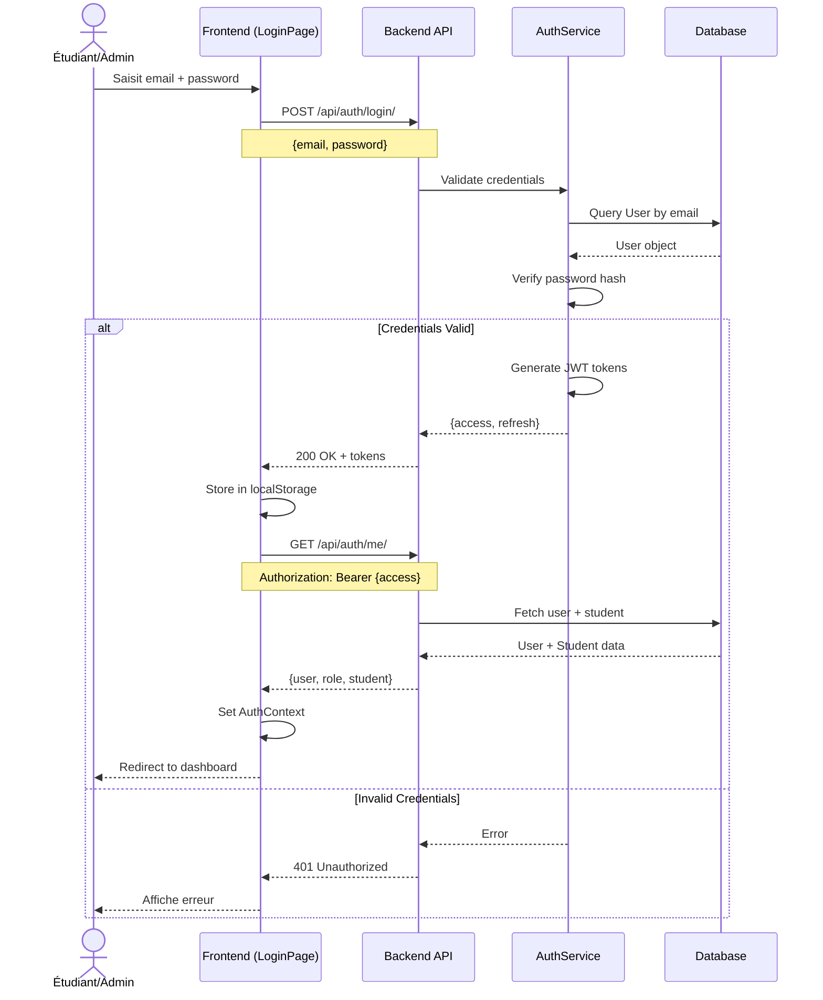
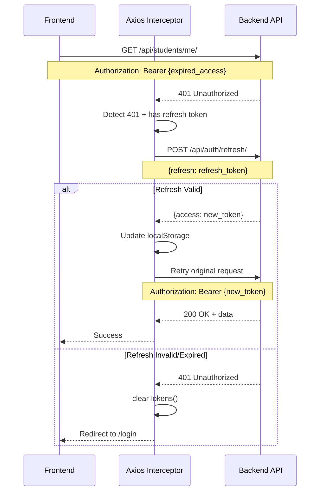
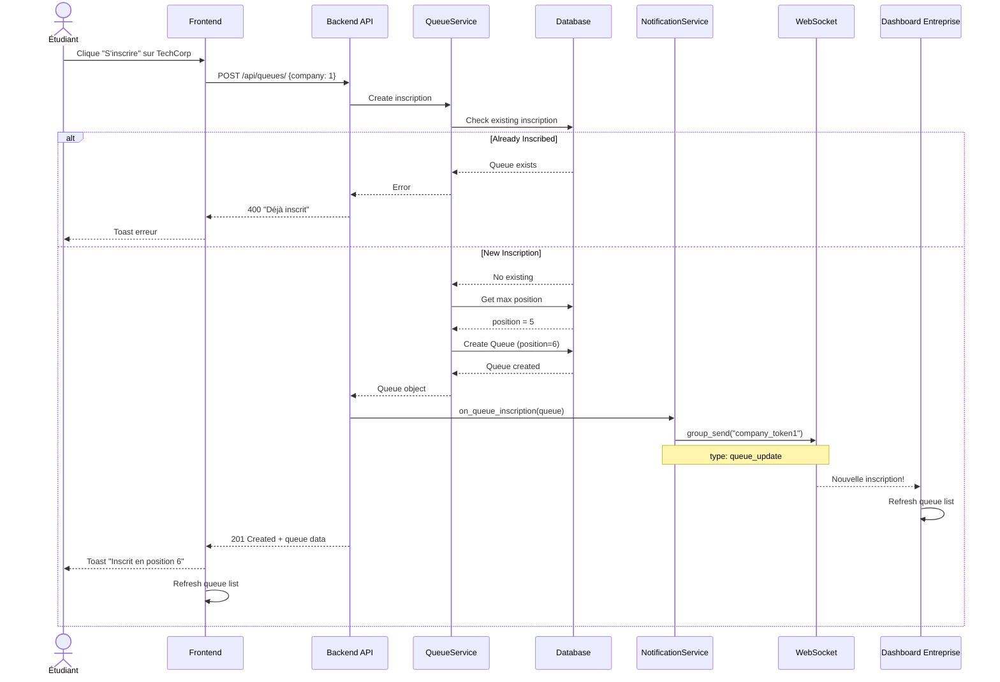
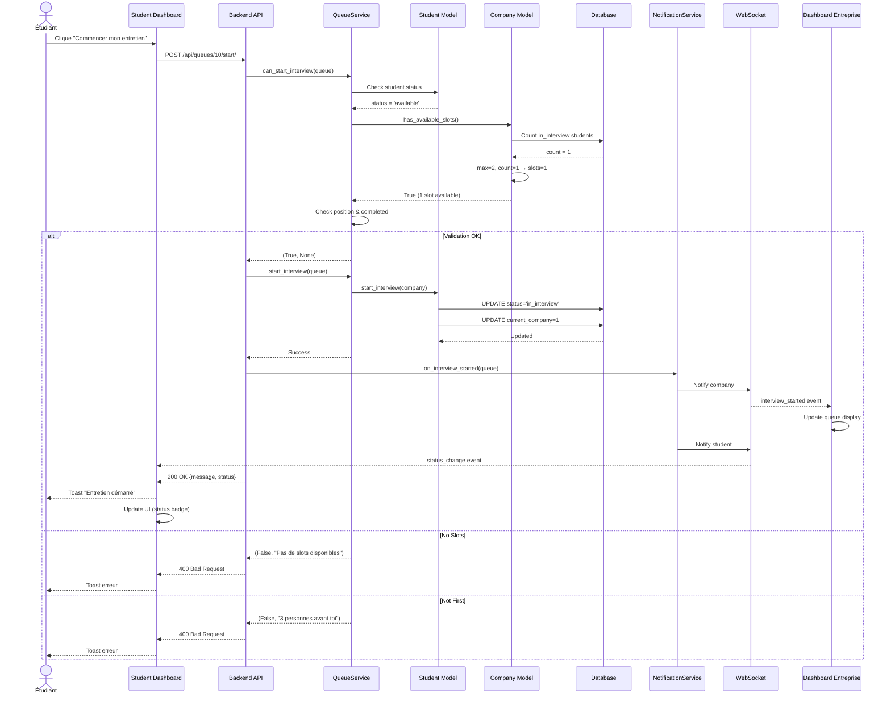
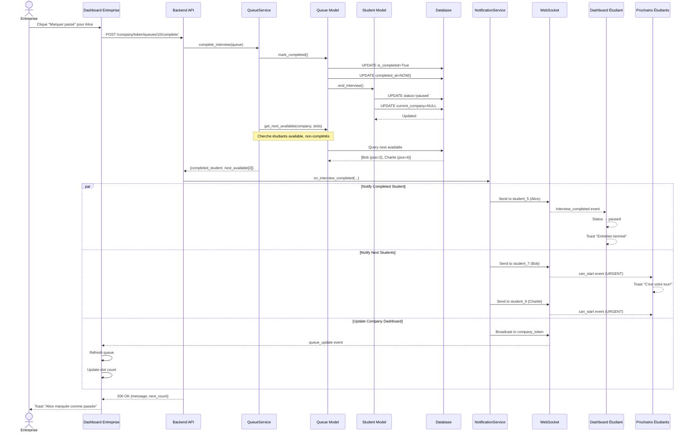
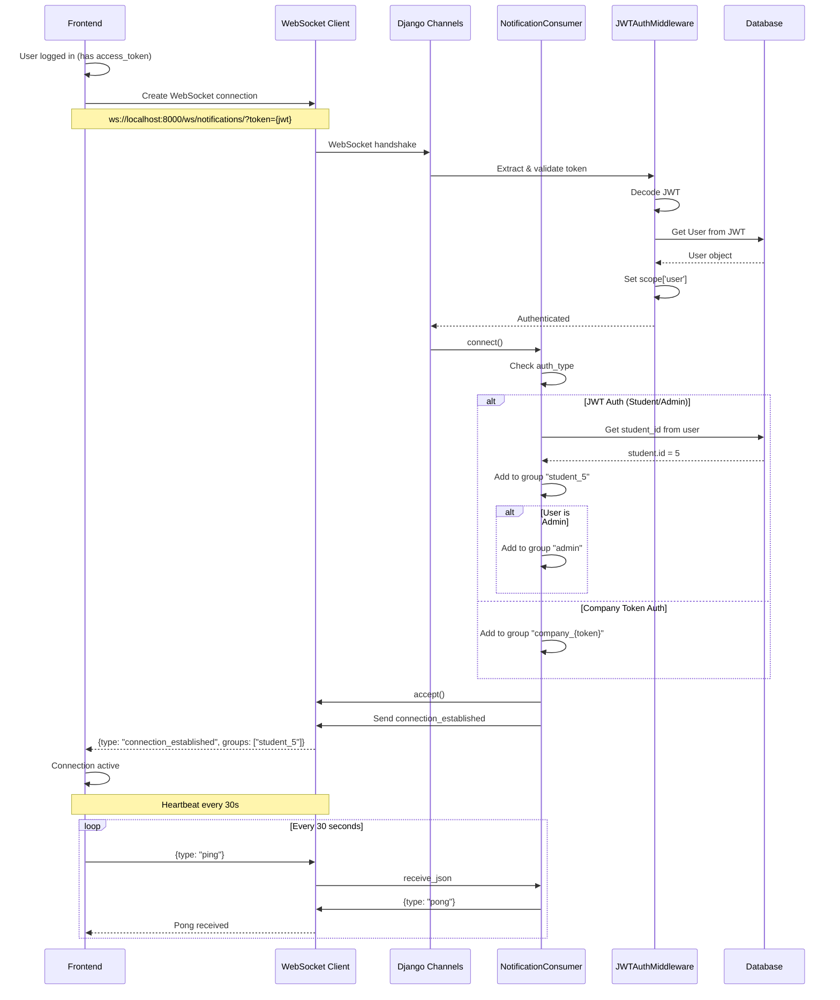
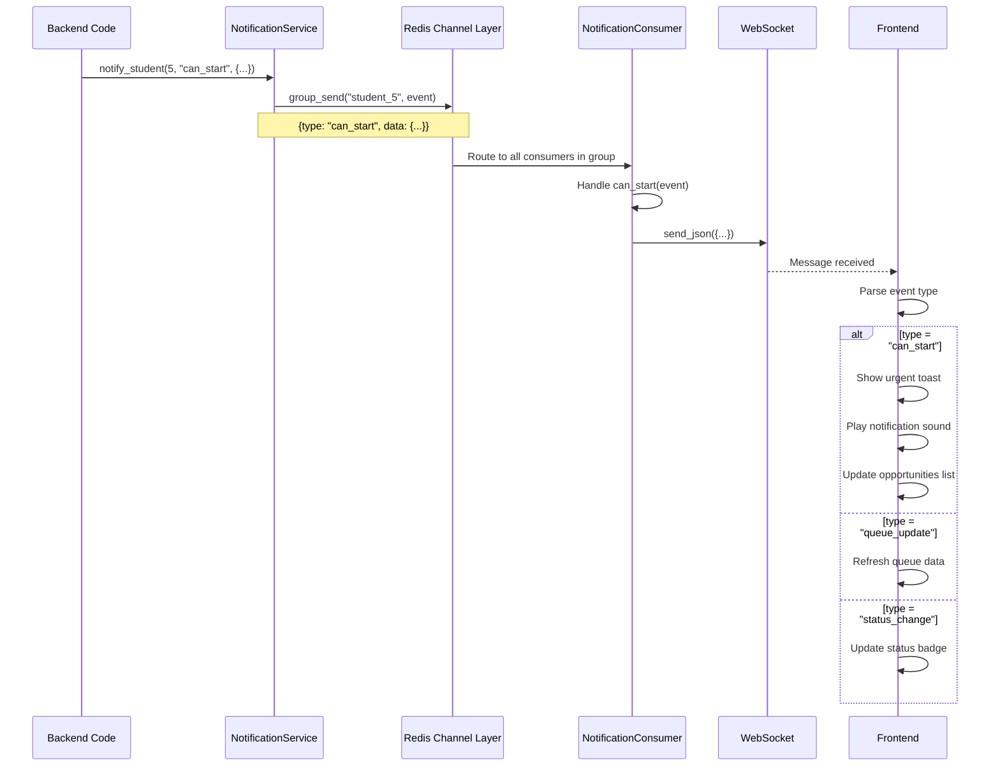
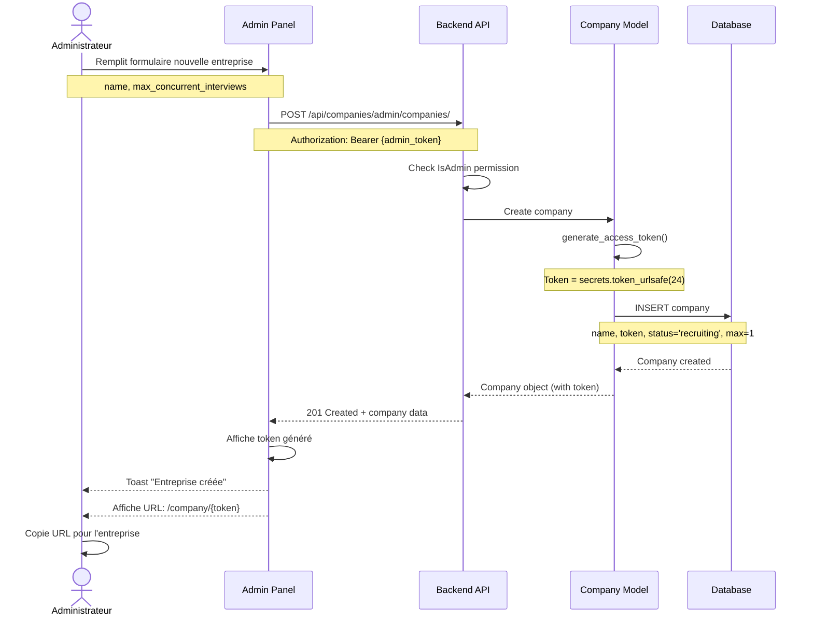
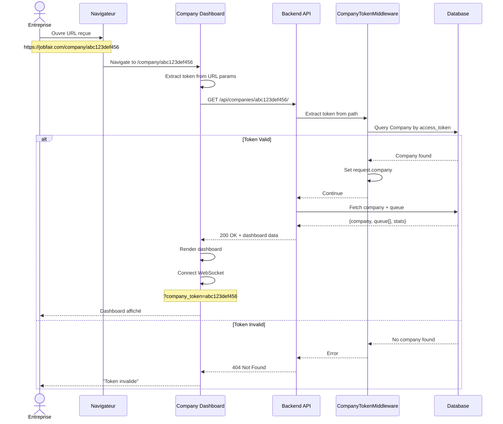
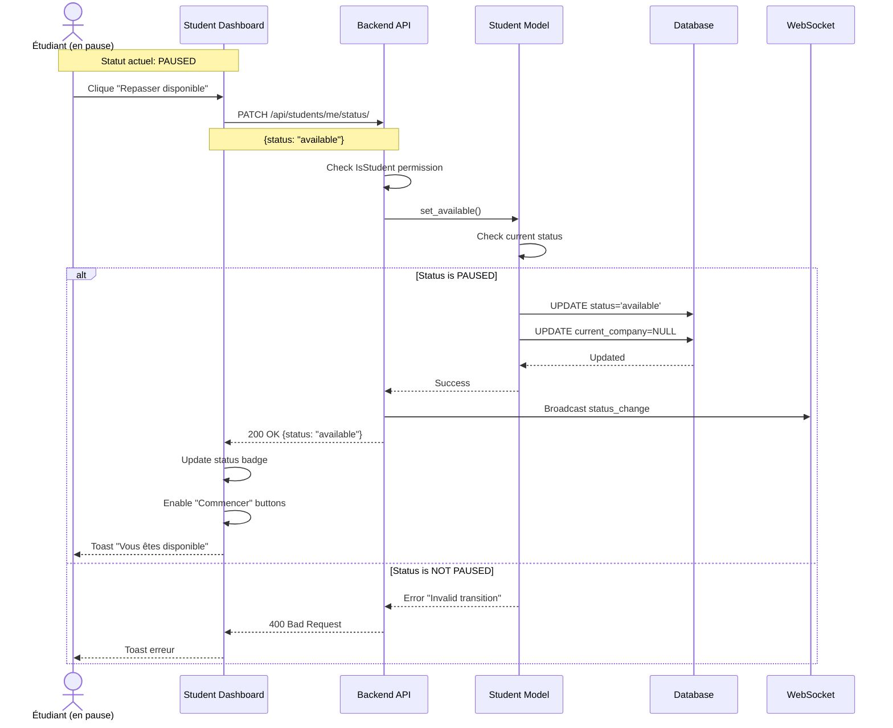

# 🔄 Data Flows - Plateforme JobFair

Documentation des flux de données principaux de la plateforme, illustrant comment les données circulent entre le frontend, le backend, et les utilisateurs.

---

## 1. Flux d'Authentification JWT (Étudiant/Admin)

### Connexion



**Données entrantes** :
- `email` : string
- `password` : string (plaintext, hashé côté backend)

**Données sortantes** :
- `access` : JWT access token (30 min)
- `refresh` : JWT refresh token (1 jour)

**Stockage** :
- localStorage : `jobfair_access_token`, `jobfair_refresh_token`

---

### Auto-Refresh Token



**Mécanisme** :
- Interceptor Axios détecte 401
- Tente auto-refresh si `refresh_token` disponible
- Retry de la requête originale avec nouveau token
- Si échec → logout + redirect

---

## 2. Flux d'Inscription à une File d'Attente



**Données entrantes** :
- `company` : ID entreprise

**Données sortantes** :
- `id` : ID queue entry
- `position` : Position dans la file
- `can_start` : boolean
- `reason` : string

**Side effects** :
- Notification WebSocket → Dashboard entreprise
- Position auto-calculée (max + 1)

---

## 3. Flux de Démarrage d'Entretien



**Validations** :
1. Étudiant en statut `available`
2. Pas déjà `current_company` ailleurs
3. Entreprise a des slots disponibles
4. Position correcte dans la file (premiers non-complétés)

**Données sortantes** :
- `message` : Confirmation
- `status` : Nouveau statut (`in_interview`)
- `company` : Nom de l'entreprise

---

## 4. Flux de Completion d'Entretien



**Side effects** :
1. Queue entry : `is_completed = True`, `completed_at = NOW()`
2. Student : `status = 'paused'`, `current_company = NULL`
3. Slot libéré immédiatement
4. Notifications multiples via WebSocket :
   - Étudiant complété → info completion
   - Prochains étudiants → notification urgente
   - Dashboard entreprise → mise à jour file

**Données sortantes** :
- `student_id` : ID étudiant marqué
- `is_completed` : true
- `next_available_count` : Nombre de prochains étudiants

---

## 5. Flux de Notifications en Temps Réel (WebSocket)

### Connexion WebSocket



---

### Envoi de Notification



**Types d'événements** :
- `notification` : Notification générique
- `queue_update` : File d'attente modifiée
- `status_change` : Statut changé
- `interview_started` : Entretien démarré
- `interview_completed` : Entretien terminé
- `can_start` : C'est votre tour (URGENT)

---

## 6. Flux Admin : Création d'Entreprise



**Données générées** :
- `access_token` : Token unique 32 chars (auto-généré)
- URL entreprise : `https://jobfair.com/company/{token}`

**Sécurité** :
- Token généré cryptographiquement sûr (`secrets.token_urlsafe`)
- Unique constraint sur DB
- Régénérable par admin si compromis

---

## 7. Flux Entreprise : Accès Dashboard (Token-based)



**Particularités** :
- Pas de compte User
- Token dans l'URL uniquement
- Pas de login/logout classique
- WebSocket authentifié via même token

---

## 8. Flux Étudiant : Repasser Disponible



**Règle métier** :
- Seul l'étudiant peut faire cette action (R5)
- Uniquement depuis statut `paused`
- `in_interview` → `available` impossible (doit passer par completion)

---

## Résumé des Patterns

### 1. Validation en Cascade
Toutes les actions critiques passent par :
1. Permission check (DRF)
2. Service method (business logic)
3. Model method (data integrity)
4. Database operation

### 2. Notifications Asynchrones
Après chaque modification importante :
1. Opération DB commit
2. `NotificationService` appelé
3. Events envoyés via Channel Layer
4. Consumers broadcast aux groups
5. Frontend reçoit et réagit

### 3. Auto-Refresh Frontend
- React Query pour cache + refetch automatique
- WebSocket pour updates push instantanés
- Optimistic updates quand pertinent

### 4. Gestion d'Erreur
Backend :
```python
try:
    QueueService.start_interview(queue)
except ValueError as e:
    return Response({'detail': str(e)}, status=400)
```

Frontend :
```javascript
try {
    await queueAPI.startInterview(queueId)
    toast.success("Entretien démarré")
} catch (error) {
    toast.error(error.response?.data?.detail || "Erreur")
}
```

---

Cette documentation des flux permet de comprendre comment les données circulent dans le système et comment les différents composants interagissent.
